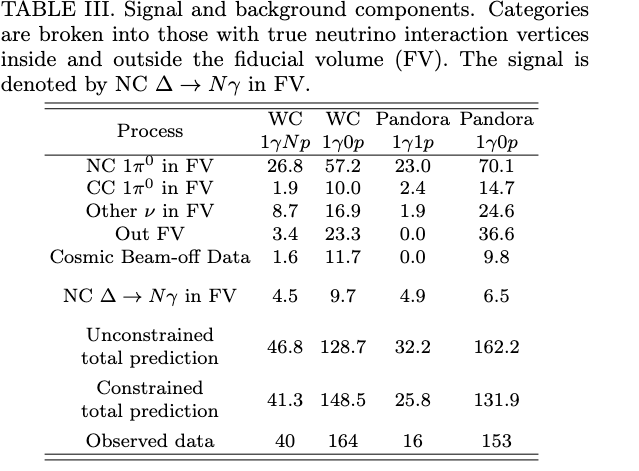

# 2025-12-17: Checking NC Delta Rad in MC 1e20 BNB+Cosmic Sample
## Issue: Ran ICARUS NC Delta Medulla selection on MC 1e20 sample, get empty results for true NC Delta Rad selection
## Solution
1. Actually no NC Delta Rad in samples. Need to check
2. Bug in code

### Solution 1
1. Check mc truth label
GENIE label for resonance: https://github.com/GENIE-MC/Generator/blob/master/src/Framework/ParticleData/BaryonResonance.h
2. Must be NC, have Delta (1232) - corresponds to genie code 0, decay to 1g0p/1g1p

Branches to use:
1. `rec.mc.nu.isnc`
2. `rec.mc.nu.resnum`
3. `rec.mc.nu.prim.pdg`

For file `input001-reweighted.flat.caf.root`;
Evt 28 shows following:

```
[1 0 0]
[ 0 -1 -1]
[  12   22 2212 2212 2112 2112   13 2212 2212 2212 2212 2212 2212 2112
 2112 2112 2112 2112 2112   13   22 2212 2212]
```

### Solution 2
1. Disabled `trigger_emulation_cut`, which is a ICARUS variable not existing in SBND
2. Cross checked selected true NC Delta Rad with flatCAF variables, both match


## Notes
1. MC PDG Codes: https://pdg.lbl.gov/2021/reviews/rpp2020-rev-monte-carlo-numbering.pdf
2. Delta Res PDG: https://pdg.lbl.gov/2021/tables/rpp2021-tab-baryons-Delta.pdf


# 2025-12-18: Creating Enhanced NC Delta Rad Samples
## Task: Want to have enhanced NC Delta Rad samples
## Approach: Use `SinglePhotonAnalysis` module from sbncode
1. `prodgenie_nu_singleinteraction_tpc_NCDeltaRadiative_filtered_sbnd.fcl` gives nothing.
2. Using `prodgenie_nu_singleinteraction_tpc_NCRadiativeResonant_filtered_sbnd` with modifications for `NCDeltaRad`

After `gen` stage, run standard fcls
1. `standard_g4_sbnd.fcl`
2. `standard_detsim_sbnd.fcl`
3. `standard_reco1_sbnd.fcl`
4. `standard_reco2_sbnd.fcl`
5. `cafmakerjob_sbnd.fcl`

Running through SPINE on EAF and merge hdf5 to flatCAF: see https://github.com/seokjuchung/SPINE_Inference_EAF


# 2025-12-19: Understanding Harry's gORe selection
1. `delta_mass_N_MC`

Check grid status with
```
jobsub_q -G sbnd --user="$USER"
```

## Some Grid issues and how to solve them
1. Jobs are on hold
Use `jobsub_release $USER`. This will relaunch held jobs with exactly the same condition.

2. Deleting problematic files
`find . -maxdepth 1 -type f -size -10k -delete`
Find with `find . -maxdepth 1 -type f -size -10k -ls`

# 2025-12-22: Analyzing output from 1e20 MC
## Selection: Based on reco variables
### 1g0p
1. Fiducial Cut
Fiducial Volume Cut defined in SPINE post-processor. 
Interaction vertex reconstructed within 25 cm border from x and y, 50 cm border downstream z, 30 cm border upstream z
2. Containment Cut
All particles/spacepoints contained within 5 cm of the detector edges.
No spacepoints are allowed to be reconstructed in a TPC that did not create it.
3. Flash Cut
Flash time cut on interaction.
[0, 1.6] us for BNB.
4. gORe Topology Cut
Single shower cut.
No muon, charged pion, exactly single shower
Muon E = 25 MeV, Pion = 25 MeV, Shower = 25 MeV
5. Proton Cut
No protons.
Proton E = 50 MeV

### 1g1p
Same as 1g0p, single proton

## Signal: Based on MC Truth Variables
### NC Delta Res 1g0p
1. Fiducial Cut
2. Containment Cut
3. Single Photon
Photon = 25 MeV
4. No Electrons
Electron = 25 MeV
5. No Muons
6. No Charged Pions
7. No Protons
8. Has NC Delta NG interaction
    1. Is NC
    2. Is Delta Res (Genie Interaction Number is 0, Delta(1232))
    3. Single Photon
    4. Only Photons and Nucleons: Only 22, 2112, 2212

### NC Delta Res 1g1p
Same as 1g0p with single proton

## Categories: These are based on NC truth
1. Contained, Fiducial, Single Photon, No Electrons, No Muons, No Charged Pions
2. Single Photon Other (non contanined/fiducial)
3. Contained, Fiducial, Single Electron, No Photons, No Muons, No Charged Pions
4. Single Electron Other
5. Cont, Fiducial, dual Photon
6. Dual Photon Other
7. NC Other
8. CC Ohter
9. Cosmic

## Checks
1. Comparison with MicroBooNE
    1. Signal: 938 1g0p, 717 1g1p
    2. uB expects 9.7/6.5 (6.37e20) WC, 4.5/4.9 (6.8e20) Pandora



    3. Sample is 1e20 * (1-40/800) = 0.95e20
    4. SBND is 110 m, uB is 470 m away from beam
    5. Factor is (470/110)^2 * (0.95/6.37) = 2.7
    6. Discrepancy by factor of O(100)??

### Results
1. Plot: Energy Hist Per category
2. Check Purity/Efficiency
    1. Use `true_mc_category`
    * 0: NC ∆->Nγ
    * 1: NC Other Single Photon
    * 2: NC π0 (∆ Res)
    * 3: NC π0 (Other)
    * 4: NC Charged π
    * 5: Other NC
    * 6: CC-Electron
    * 7: Other CC
    * 8: Non-neutrino

    2. Results
        1. 1g0p: Total 30828 / 681 --> Eff = 681/938 * 100 = 72.6%, Pur = 681/30828 * 100 = 2.21%
        2. 1g1p: Total 17238 / 500 --> Eff = 500/717 * 100 = 69.7%, Pur = 500/17238 * 100 = 2.90%
        3. Note: This is without gORe separation, so room for improvement.
    3. After post-separation: How to increase purity? Probably need e/g separation

    For ICARUS:

        1. Primary photon softmax > 0.092 (`reco_leading_primary_gOre_photon_softmax`)
        2. Start dE/dx > 3.645 MeV/cm (`reco_leading_primary_gOre_start_dedx`)
        3. Shower axial spread > -0.005 (`reco_leading_primary_gOre_axial_spread`)
        4. Shower direction spread < 0.068 (`reco_leading_primay_gOre_directional_spread`)
        5. 1g0p: Total 10266 / 488 --> Eff = 488/938 * 100 = 52.0%, Pur = 4.75%
        6. 1g1p: Total 4215 / 299 --> Eff = 59.8%, Pur = 7.09%

    5. Compare with ICARUS values
        1. 88.8%/2.9% before
        2. 71.5%/6.1% After g/e separation

## To Do
3. Difference or how to use leading/subleading shower efficiently?


# 2025-12-23: Sanity checks
1. Is the `true_mc_category` actually representing NC Delta Rad?
Check distribution of `true_mc_category` for `signal_1g0p` and `signal_1g1p` tree. With exception of few O(1) events, all are classified as category 0.
2. 

Looking at `signal` tree: Compare `reco_` and `true_` value, validate reconstruction.


# 2025-12-24: Looking at grid issues
Two main reasons why jobs were failing.
1. `delta_mass_N_MC` and `neutron_momentum` custom gORe varialbes. Disabled for now, shouldn't be too significant
2. All `mctruth` variables (including thoses which are medulla built-in). Single file `mc1e20/input600-reweighted.flat.caf.root`.